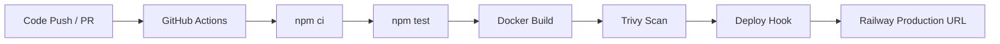

# First Pipeline Challenge

[](https://github.com/PalmChas/M4K-Pipeline/actions/workflows/pipeline.yml)

```text
 __  __ _  _  _       ____  _            _ _
|  \/  | || || |     |  _ \(_)_ __   ___| (_)_ __   ___
| |\/| | || || |_    | |_) | | '_ \ / _ \ | | '_ \ / _ \
| |  | |__   _|__|   |  __/| | |_) |  __/ | | | | |  __/
|_|  |_|  |_|        |_|   |_| .__/ \___|_|_|_| |_|\___|
                             |_|
```

Live deployment: [m4k-pipeline-production.up.railway.app](https://m4k-pipeline-production.up.railway.app)

## About
Week 4 Boiler Room Hackathon mission: build a full CI/CD pipeline with tests, Docker image build, Trivy scan and live deployment.

## Architecture


## Endpoints
- `GET /` -> dashboard landing page
- `GET /status` -> service status + timestamp
- `GET /health` -> health check + uptime
- `GET /metrics` -> request count and average response time metrics
- `GET /db-status` -> MongoDB connection and persistence status
- `GET /mongo-proof` -> writes and reads a counter in MongoDB (live DB proof)
- `GET /k8s` -> runtime proof (pod, namespace, node, kubernetes API host)

## Kubernetes
Kubernetes manifests are included in `k8s/`:
- Backend Deployment/Service (`first-pipeline`)
- Frontend Deployment/Service (`frontend`)
- MongoDB StatefulSet + headless Service (`mongo`)
- Frontend ConfigMap (nginx reverse proxy)
- Secret (`app-secrets`) for Mongo URL and credentials
- Ingress, HPA, Namespace, Kustomization
- Namespace: `m4k-pipeline`

Quick deploy:
```bash
pwsh ./scripts/deploy-k8s.ps1
# or
./scripts/deploy-k8s.sh
```

Proof for teacher:
```bash
kubectl get deploy,sts,svc,pods -n m4k-pipeline -o wide
kubectl port-forward svc/frontend 8080:80 -n m4k-pipeline
curl http://localhost:8080/k8s
curl http://localhost:8080/mongo-proof
```

## Pipeline Demo GIF


## Team
Team name: `M4K Gang`

Members:
- Oskar Palm
- Carl Persson
- Jonny Nguyen
- Julia Persson
- Mattej Petrovic

### Team Bios
- 🧭 Oskar Palm - Navigator who keeps architecture and direction aligned.
- ⚙️ Carl Persson - Driver focused on implementation and delivery speed.
- 🔍 Jonny Nguyen - Researcher who hunts fixes and improves workflow reliability.
- 🧪 Julia Persson - Tester validating behavior and catching regressions early.
- 🚀 Mattej Petrovic - DevOps finisher driving deployment and release polish.

## Implemented Upgrades
- Staging and production deployment jobs are configured in GitHub Actions.
- Slack notifications are sent on successful deploy and pipeline failure.
- Chaos restart job is enabled for staging deploy flow.
- Prometheus-format metrics are available at `GET /metrics/prometheus`.
- Kubernetes Diamond extras: MongoDB StatefulSet, Secret, and deploy scripts.
- Runtime metrics persistence is enabled in MongoDB (`runtime_metrics` collection).

## Future Plans
- Add Grafana dashboard JSON and link screenshots for metrics.
- Add release tags with automated changelog generation.
- Add canary deploy strategy for production rollouts.
- Add SLO error-budget tracking and alert thresholds.

## Trivy Findings (2026-02-10)
Latest local scan report: `trivy-report.txt`

Summary:
- OS packages (alpine): 32 total (CRITICAL: 2, HIGH: 4, MEDIUM: 21, LOW: 5)
- Node.js packages: 7 total (CRITICAL: 0, HIGH: 5, MEDIUM: 0, LOW: 2)

Key findings:
- `libcrypto3` / `libssl3`: `CVE-2025-15467` (CRITICAL), fixed in `3.3.6-r0`
- OpenSSL: `CVE-2025-69419` (HIGH)
- `cross-spawn@7.0.3`: `CVE-2024-21538` (HIGH), fixed in `7.0.5`
- `glob@10.4.2`: `CVE-2025-64756` (HIGH), fixed in `10.5.0` or `11.1.0`

Misconfiguration found earlier:
- `DS-0002`: container ran as root
- Status: fixed by setting `USER node` in `Dockerfile`

## Status
- All tests passing
- Security scan complete
- Deployed to production
- `/metrics` endpoint implemented

<!-- Careful readers only: try the hidden endpoint /secret -->
